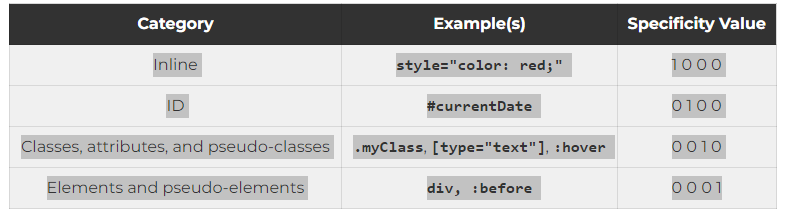

# Normalize.css
Different browsers treat line spacing, spacing and font weight differently eg.
- Chrome may put a heading of 1rem by default
- Safari can put a heading of 1.3rem by default

So this all creates a disagreement, the webpage may look good on Chrome, but on Safari its worse of than Chrome.

## The fix:
Include the link rel → 

``` html 
<link rel="stylesheet" href="https://cdnjs.cloudflare.com/ajax/libs/normalize/8.0.1/normalize.min.css">
```

<strong>OR</strong> Alternatively, download the file on: https://github.com/necolas/normalize.css/blob/master/normalize.css
then include into your HTML file:

``` html
<link rel="stylesheet" href="styles/normalize.css">
```

# CSS Specifity

- Inline CSS takes the most priority with 1000
- <code>#ID</code> tags take power with 0100
- <code>.name, input["required"], :hover</code>Classes, attributes, and pseudo-classes has 0010
- <code>h1, ::before, ::after</code> elements and pseudo-elements have 0001, has the least specifity

## Tip for Inline CSS
- ensure you only use it for troubleshooting or debugging, this is way easier than to look at the whole file
